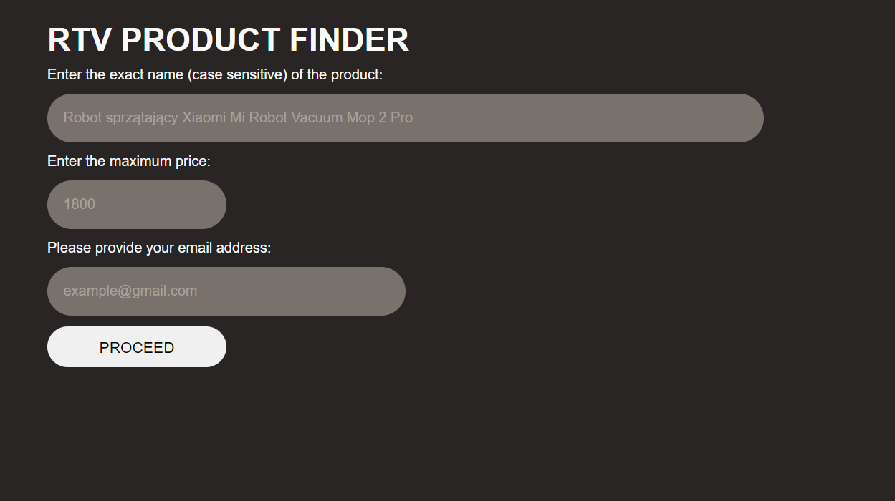
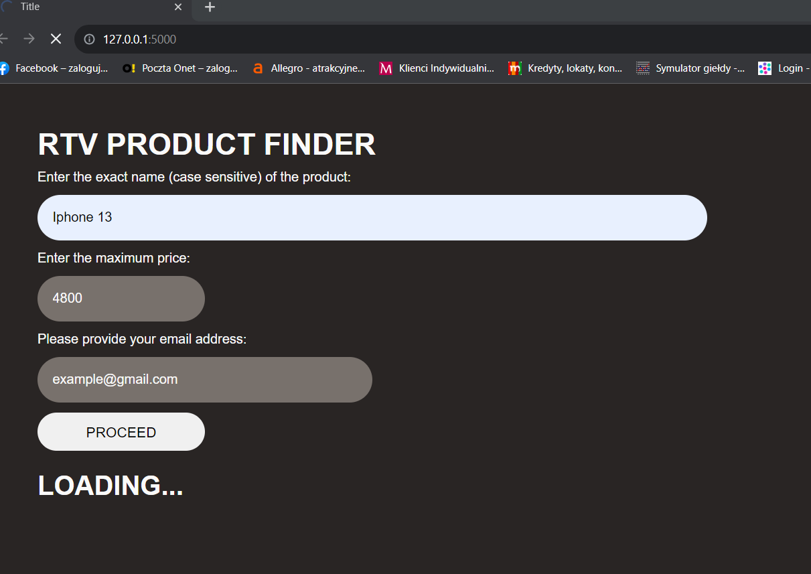
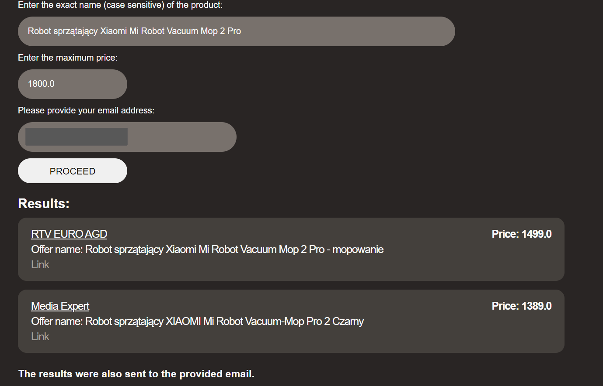
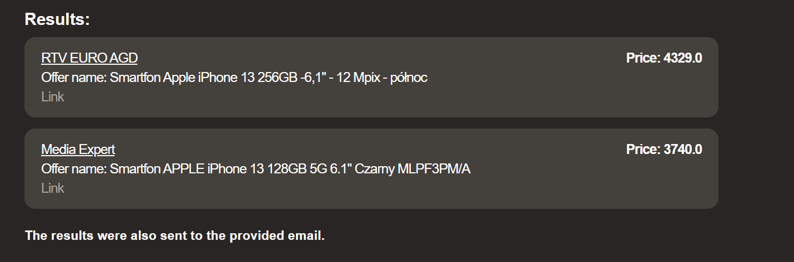
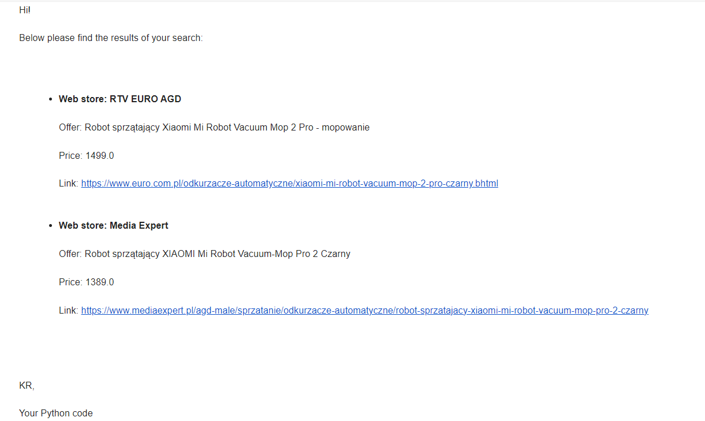
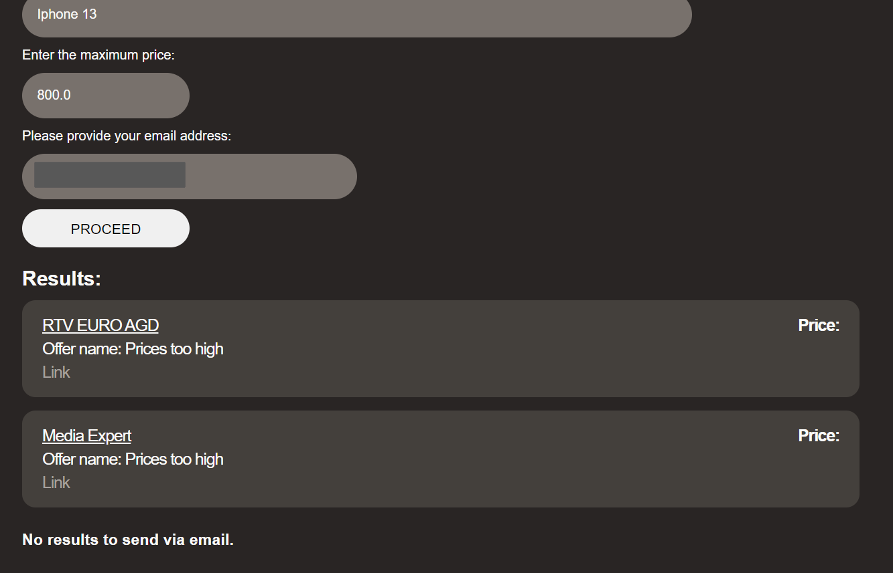

# RTV web scraping

The Python program finds an item provided by the user on two Polish web pages selling RTV and AGD items, on condition that the price is lower than maximum set. The results are summarized in web GUI and sent to the inserted email address.

## Imports

For web scraping, selenium is used (I considered Beautiful Soup, but the content of the pages is dynamic). Since I tested the code on local machine using Chrome, path to chromedriver is required. 
```
service = Service('path')  # path to chromedriver for local machine
```
Please note the code works as at end of August 2023. In case there is a newer version of Chrome or structure of pages changes (which usually happens from time to time), the code has to be adjusted accordingly. Some web pages also run scripts blocking automated programs, so web scraping might not work or could be extremely hard.

A simple web GUI is created with Flask, while email is sent using yagmail library. For the purpose of this mini project, I created an email address on google, which acts as a sender. To enable using it with code, I had to turn on two step verification and create an App with password (via account options). Additionally, it is best to create a secret key, rather than hard code password in the program. On my machine I extract it with getenv function from os library.

## Code

The code acts similarly for both web pages, i.e. it locates the search bar, inserts the product name and stores the results (offers, links and prices) into lists. Since often these pages don't have 100% matching results, I am calculating ratios of text similarity between searched and found products. I thought of several approaches, including cosine similarity, but it was important to catch also numbers (e.g. of models) in the name, so I went with Jaro-Winkler similarity (available in jellyfish library), as it seemed to work quite well based on few examples (vacuum robot, Iphone, smartphones, smartbands). 

A function is defined to extract a minimum price. Firstly, the indexes of the prices lower than the value inserted by the user are chosen. Then, it finds the indexes of the biggest ratios, greater than minimum (fixed at 0.5, to avoid displaying offers differing substantially from the searched product). Two highest ratios are considered, due to the fact, that the prices might be different for the same product with another color.
```
def get_min_price(ratio_list, price_list, threshold, ratio_min):
    if len(ratio_list) > 0 and len(price_list) > 0:
        help_index = [index for index, item in enumerate(price_list) if item <= threshold]
        if help_index != []:
            index = [index for index, item in enumerate(ratio_list) if item >= sorted(ratio_list)[-2] and item > ratio_min and index in help_index]
            min_price = min([price_list[i] for i in index])
            return min_price
```
Of course this approach could be further improved, but for the purpose of this project I found it sufficient.

Based on the output of the function described above, the result is determined as a tuple or a string.
```
    if offer_list == []:
        return "No offers found"
    else:
        if min_price:
            price_index = price_list.index(min_price)
            return offer_list[price_index], min_price, link_list[price_index]
        else:
            return "Prices too high"
```

To visualize the search outcome, a simple web GUI is created with Flask, that has only a home page. While rendering the template, parameters are passed, so they can be later used as Jinja values.
When POST method is called, web scraping functions are triggered. Apart from displaying the results, email is sent, provided that there is output from at least one of the web pages.

## GUI

The interface is created with an html template (templates folder), css styles and one tiny js file (static folder), which hides or unhides objects. It was not necessary, but I wanted to have all three front-end components included.

### Start page

The user has three fields to fill in.



After hitting PROCEED button, inserted values are preserved and a LOADING message pops up.



### Results

Outputs are shown in a list, with the offer name, price and link to it.





As mentioned before, email with a summary is also sent to the user.



In case there are no results for both pages, relevant message is displayed instead.




---

The idea behind this mini project could be easily expanded or adapted and deployed to run automatically, for instance only with email functionality. The deployment could take place using cloud solutions such as AWS, GCP or PythonAnywhere.

